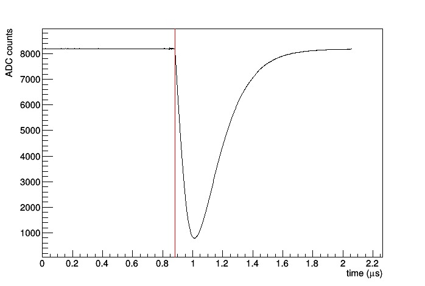
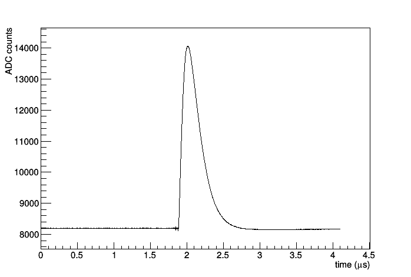
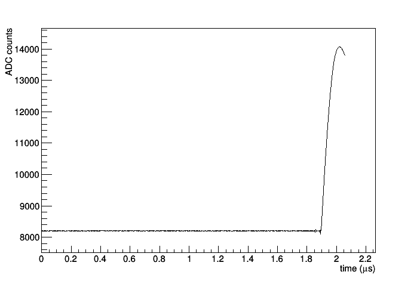
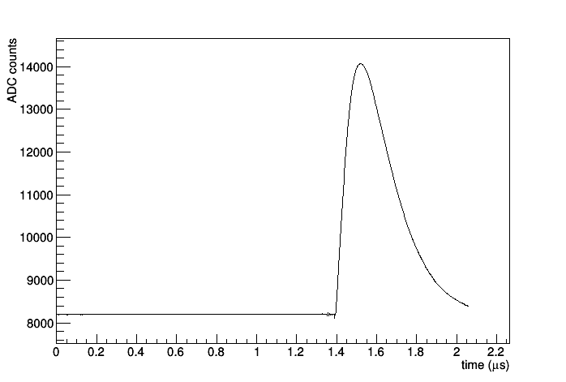

# CAEN V1370 DAQ

## Description:

DAQ software for a CAEN V1730 digitizer with waveform recording firmware. Software assumes connection through a V1718 VME-USB Bridge

This software is based on the CAEN wavedump example program

## Installation:
Requires the CAEN Digitizer libraries. Install in this order:
1. [CAEN VME library](http://www.caen.it/csite/CaenProd.jsp?idmod=689&parent=38) 
2. [CAEN USB library](http://www.caen.it/csite/CaenProd.jsp?idmod=417&parent=11)
3. [CAEN Comm library](http://www.caen.it/csite/CaenProd.jsp?parent=38&idmod=684)
4. [CAEN digitizer](http://www.caen.it/csite/CaenProd.jsp?parent=43&idmod=717)

If the tar files containing the libraries are placed in the **drivers** directory, run **source CAEN\_driver\_install.sh** as root in that directory to automatically install the libraries.

**Note:** Updates to your system may break the CAEN libraries. If the DAQ software stops working, try reinstalling the VME and USB libraries.

Requires ROOT (available [here](https://root.cern.ch/downloading-root)). You may need these libraries:
1. libX11-devel.x86_64
2. libXpm-devel.x86_64
3. libXft-devel.x86_64
4. libXext-devel.x86_64

* If you are getting an error about 'shape.h', try:

        ln -s /usr/include/X11/extensions/shapeproto.h /usr/include/X11/extensions/shape.h

Once these are installed, use make to build the software.

## Usage:

    usage: CAENdaq  [-h] [-v] [-x XMLFILE] [--xmlout XMLFILE] [-q] [w0] [w1]
                    [w2] [w3] ... [-o FILE] [-r RECLEN] [-a BASEADDRESS] 
                    [-n NUM] [-d DURATION] [--posttrigger VAL]
                    [--polarity0 POLARITY] ... [--DCoffset0 OFFSET] ...
                    [--threshold0 THRESHOLD] ... [--trslope0 POLARITY] ... 

    Reads waveforms from a CAEN V1730 digitizer.

    Mandatory arguments to long options are mandatory for short options too.
      -h, --help                 Show this help message and exit
      -v, --verbose              Prints verbose setup information
      -x XMLFILE, --xml XMLFILE  Use settings in XMLFILE. This
                                 overrides other command line settings
      --xmlout XMLFILE           Save settings to xml file
      -q, --quit                 Used with --xmlout. Quits program after
                                 saving settings
      --tutorial                 Open the tutorial in a web browser

     The following options can also be set using an XML file, with the
     long options as the XML tags:
      -w <CH>, --ch <CH>         Record the waveform on CH
                                 Valid options are 0-7
      -o FILE, --outfile FILE    Save waveform to FILE
      -n NUM, --saveInterval     After NUM events, save a temporary file.
                                 At the end of the run, these will be merged
      -r RECLEN, --reclen RECLEN Set number of samples recorded to RECLEN
      -a BASEADDRESS, --baseaddress BASEADDRESS
                                 Set digitizer base address to BASEADDRESS
      -d DURATION, --duration DURATION
                                 Duration of the run. If an integer is
                                 specified, that many events are recorded.
                                 If a time is specified in HH:MM:SS format
                                 the daq will run for that long. Acquisition
                                 starts automatically.
                                 If not used, daq must be started manually
      --polarity<CH> POLARITY    Set pulse polarity of channel CH
                                 Valid options are POSITIVE or NEGATIVE
      --DCoffset<CH> OFFSET      Set DC offset of channel CH in ADC counts
      --threshold<CH> THRESHOLD  Set the trigger threshold of channel CH
                                 in ADC counts
      --trslope<CH> POLARITY     Trigger slope. Can be POSITIVE or NEGATIVE
      --posttrigger VAL          Set the post trigger

### Note
   When the program starts, it will create a temporary directory called temp_`<timestamp>`, where `<timestamp>` is the unix time when the program started. Temporary root files containing `<saveInterval>` events will be saved here.

When the program exits safely these files will be merged together, with the resulting file moved to the working directory. The temporary directory will then be removed. 

If the program crashes, the temporary files will not be removed, so most of the data from the run can be salvaged by looking in this directory.

## Tutorial

### Pulse and Trigger Polarity

For a positive pulse, polarity<CH> should be set to POSITIVE, and for a negative pulse, it should be set to NEGATIVE. trslope<CH> may be set to POSITIVE or NEGATIVE depending on where the desired trigger point is. A general rule of thumb is that the trigger polarity and the pulse polarity should be the same.

  
Positive pulse with positive trigger

Trigger will occur when the signal **rises above** 100. The red line is the trigger point.

Example command line arguments:

    CAENdaq -o FILE.root -d 1000 --ch 0 --polarity0 POSITIVE --threshold0 100 --trslope0 POSITIVE

[Example xml file](xml/PositivePulsePositiveTrigger.xml)

 
Positive pulse with negative trigger

Trigger will occur when the signal **falls below** 100. The red line is the trigger point.

Example command line arguments:

    CAENdaq -o FILE.root -d 1000 --ch 0 --polarity0 POSITIVE --threshold0 100 --trslope0 NEGATIVE

[Example xml file](xml/PositivePulseNegativeTrigger.xml)

 
Negative pulse with positive trigger

Trigger will occur when the signal **rises above** 100. The red line is the trigger point.

Example command line arguments:

    CAENdaq -o FILE.root -d 1000 --ch 0 --polarity0 NEGATIVE --threshold0 100 --trslope0 POSITIVE

[Example xml file](xml/NegativePulsePositiveTrigger.xml)

 
Negative pulse with negative trigger

Trigger will occur when the signal **falls below** 100. The red line is the trigger point.

Example command line arguments:

    CAENdaq -o FILE.root -d 1000 --ch 0 --polarity0 NEGATIVE --threshold0 100 --trslope0 NEGATIVE

[Example xml file](xml/NegativePulseNegativeTrigger.xml)

### Record length

The record length setting sets the number of samples in a waveform. A higher number will create a longer waveform.

 
 Low record length 

In this example the record length is set to 512 samples.

Example command line arguments:

    CAENdaq -o FILE.root -d 1000 --ch 0 --reclen 512 --threshold0 100

[Example xml file](xml/RecordLength_512.xml)

 
 Medium record length 

In this example the record length is set to 1024 samples (the default).

Example command line arguments:

    CAENdaq -o FILE.root -d 1000 --ch 0 --reclen 1024 --threshold0 100
    
[Example xml file](xml/RecordLength_1024.xml)

 
 High record length 

In this example the record length is set to 2048 samples.

Example command line arguments:

    CAENdaq -o FILE.root -d 1000 --ch 0 --reclen 2048 --threshold0 100
    
[Example xml file](xml/RecordLength_2048.xml)

### Post Trigger

The post trigger setting sets how much of the waveform will be after the trigger occurs. valid settings are 0 to 100. Setting this to 50 is a good rule of thumb.

 
 Post trigger of 0 

Example command line arguments:

    CAENdaq -o FILE.root -d 1000 --ch 0 --posttrigger 0 --threshold0 100
    
[Example xml file](xml/PostTrigger_0.xml)

 
 Post trigger of 25 

Example command line arguments:

    CAENdaq -o FILE.root -d 1000 --ch 0 --posttrigger 25 --threshold0 100
    
[Example xml file](xml/PostTrigger_25.xml)

 
 Post trigger of 50 (the default setting)

Example command line arguments:

    CAENdaq -o FILE.root -d 1000 --ch 0 --posttrigger 50 --threshold0 100
    
[Example xml file](xml/PostTrigger_50.xml)

 
 Post trigger of 75 

Example command line arguments:

    CAENdaq -o FILE.root -d 1000 --ch 0 --posttrigger 75 --threshold0 100
    
[Example xml file](xml/PostTrigger_75.xml)

 
 Post trigger of 100 

Example command line arguments:

    CAENdaq -o FILE.root -d 1000 --ch 0 --posttrigger 100 --threshold0 100
    
[Example xml file](xml/PostTrigger_100.xml)

## Files:

	src/
		source files
	include/
		header files
	xml/*.xml
		Some example settings files
	icon/CAEN.png
		Icon for the notification
	Makefile
		for building the software
	draw.C
		A root script for drawing waveforms
	drivers/CAEN\_driver\_install.sh
		A script for installing the CAEN libraries. The tar files containing the libraries must be located in the same directory as this script
	img/*
		Images used in the tutorial section of this document
	
## Acknowledgements 

This software used code in CAEN's [wavedump](http://www.caen.it/csite/CaenProd.jsp?parent=38&idmod=692) example, modified to be in an object oriented framework.

