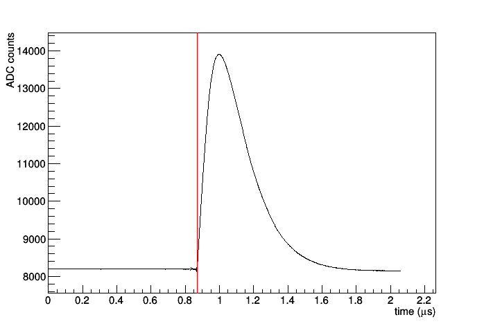
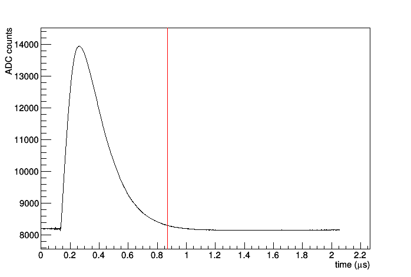
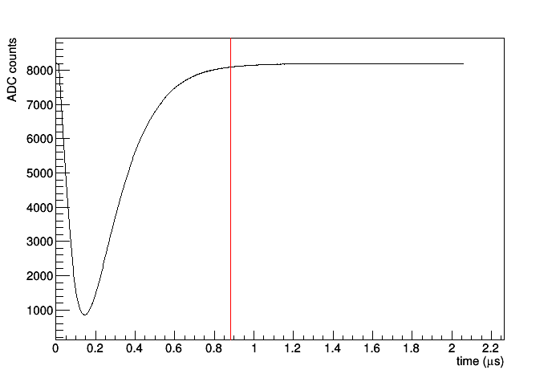
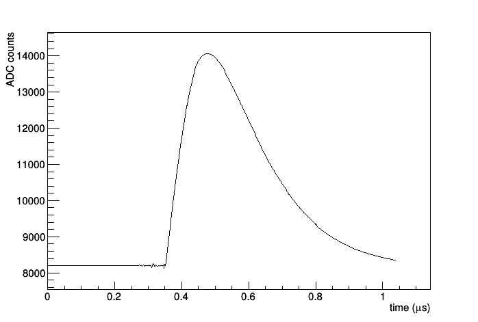
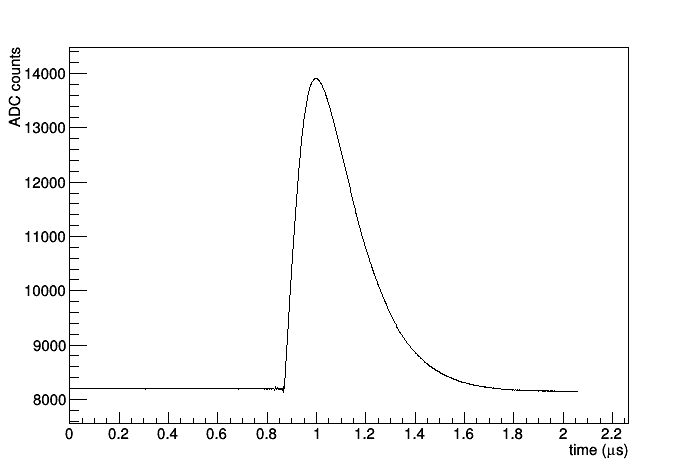
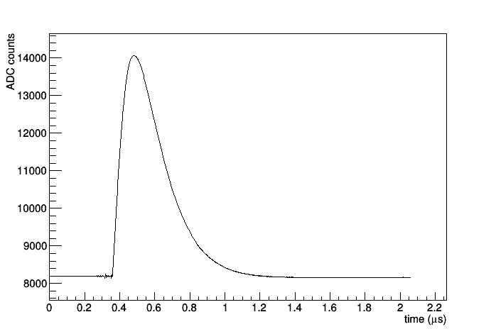
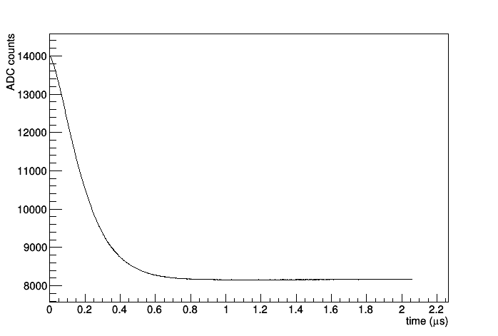

# CAEN V1370 DAQ

## Description:

DAQ software for a CAEN V1730 digitizer with waveform recording firmware. Software assumes connection through a V1718 VME-USB Bridge

This software is based on the CAEN wavedump example program

## Installation:
Requires the CAEN Digitizer libraries. Install in this order:
1. [CAEN VME library](http://www.caen.it/csite/CaenProd.jsp?idmod=689&parent=38) 
2. [CAEN USB library](http://www.caen.it/csite/CaenProd.jsp?idmod=417&parent=11)
3. [CAEN Comm library](http://www.caen.it/csite/CaenProd.jsp?parent=38&idmod=684)
4. [CAEN digitizer](http://www.caen.it/csite/CaenProd.jsp?parent=43&idmod=717)

If the tar files containing the libraries are placed in the **drivers** directory, run **source CAEN\_driver\_install.sh** as root in that directory to automatically install the libraries.

**Note:** Updates to your system may break the CAEN libraries. If the DAQ software stops working, try reinstalling the VME and USB libraries.

Requires ROOT (available [here](https://root.cern.ch/downloading-root)). You may need these libraries:
1. libX11-devel.x86_64
2. libXpm-devel.x86_64
3. libXft-devel.x86_64
4. libXext-devel.x86_64

* If you are getting an error about 'shape.h', try:

        ln -s /usr/include/X11/extensions/shapeproto.h /usr/include/X11/extensions/shape.h

Once these are installed, use make to build the software.

## Usage:

    usage: CAENdaq  [-h] [-v] [-x XMLFILE] [--xmlout XMLFILE] [-q] [w0] [w1]
                    [w2] [w3] ... [-o FILE] [-r RECLEN] [-n NUM] [-d DURATION]
                    [--posttrigger VAL] [--polarity0 POLARITY] ... 
                    [--threshold0 THRESHOLD] ... [--trslope0 POLARITY] ... 

    Reads waveforms from a CAEN V1730 digitizer.

    Mandatory arguments to long options are mandatory for short options too.
      -h, --help                 Show this help message and exit
      -v, --verbose              Prints verbose setup information
      -x XMLFILE, --xml XMLFILE  Use settings in XMLFILE. This
                                 overrides other command line settings
      --xmlout XMLFILE           Save settings to xml file
      -q, --quit                 Used with --xmlout. Quits program after
                                 saving settings
      --tutorial                 Open the tutorial in a web browser

     The following options can also be set using an XML file, with the
     long options as the XML tags:
      -w <CH>, --ch <CH>         Record the waveform on CH
                                 Valid options are 0-7
      -o FILE, --outfile FILE    Save waveform to FILE
      -n NUM, --saveInterval     After NUM events, save a temporary file.
                                 At the end of the run, these will be merged
      -r RECLEN, --reclen RECLEN Set number of samples recorded to RECLEN
      -d DURATION, --duration DURATION
                                 Duration of the run. If an integer is
                                 specified, that many events are recorded.
                                 If a time is specified in HH:MM:SS format
                                 the daq will run for that long. Acquisition
                                 starts automatically.
                                 If not used, daq must be started manually
      --polarity<CH> POLARITY    Set pulse polarity of channel CH
                                 Valid options are POSITIVE or NEGATIVE
      --threshold<CH> THRESHOLD  Set the trigger threshold of channel CH
                                 in ADC counts
      --trslope<CH> POLARITY     Trigger slope. Can be POSITIVE or NEGATIVE
      --posttrigger VAL          Set the post trigger
      --triggermode MODE         Set the trigger mode. Valid options are AND
                                 and OR.
      --coincidencewindow WINDOW Set the length of the coincidence window, in
                                 multiples of 8ns. Maximum value is 15.

## Tutorial

### Running the program

To display the DAQ command line parameters, run

    CAENdaq -h

There are two ways to set the digitizer parameters: through the command line, or via an XML file. A simple run example is:

    CAENdaq --outfile FILE.root --duration 1000 --ch 0 --polarity0 POSITIVE --threshold0 100 --trslope0 POSITIVE

These same parameters can be set via an xml file:

    <xml>
      <Active>
        <duration>
          1000
        </duration>
        <outfile>
          FILE.root
        </outfile>
        <ch0>
          1
        </ch0>
        <polarity0>
          POSITIVE
        </polarity0>
        <threshold0>
          100
        </threshold0>  
        <trslope0>
          POSITIVE
        </trslope0>
      </Active>
    </xml>

which can be run with this command:

    CAENdaq -x XMLFILE.xml

assuming the xml file is named XMLFILE.xml. Any other command line arguments which set digitizer settings will be ignored if an xml file is specified.

Note that the xml tags are the same as the command line options, eg:

    --outfile FILE.root

on the command line is equivalent to

    <outfile>
      FILE.root
    </outfile>

in the xml file.

  
XML File Generation

  The xml files used by the DAQ software can be created using a text editior, or by using the `--xmlout` command line argument. This argument will take the digitizer settings set at the command line and save them as an xml file:

    CAENdaq --outfile myfile.root --duration 3000 --ch 4 --polarity4 NEGATIVE --threshold4 100 --trslope4 NEGATIVE --xmlout mySettings.xml

will produce mySettings.xml, which will look like this:

    <xml>
      <Active>
        <outfile>
          myfile.root
        </outfile>
        <duration>
          3000
        </duration>
        <ch4>
          1
        </ch4>
        <polarity4>
          NEGATIVE
        </polarity4>
        <threshold4>
          100
        </threshold4>
        <trslope4>
          NEGATIVE
        </trslope4>
      </Active>
    </xml>

Adding `-q` on the command line will quit the DAQ after generating the xml file.

### Duration

There are two ways of using the duration option.

  
Number of events

If an integer is used as the parameter, that many events will be recorded. Example command:

    CAENdaq --duration 1000

or in XML:

    <duration>
       1000
    </duration>

will collect 1000 events before closing

  
Timed acquisition

If a time is specified in HH:MM:SS, events will be collected for that amount of time. Example command:

    CAENdaq --duration 01:30:00

or in XML:

    <duration>
        01:30:00
    </duration>

will collect events for 90 minutes before closing

### Pulse and Trigger Polarity

For a positive pulse, polarity<CH> should be set to POSITIVE, and for a negative pulse, it should be set to NEGATIVE. trslope<CH> may be set to POSITIVE or NEGATIVE depending on where the desired trigger point is. A general rule of thumb is that the trigger polarity and the pulse polarity should be the same.

  
Positive pulse with positive trigger

Trigger will occur when the signal **rises above** 100. The red line is the trigger point.

Example command line arguments:

    CAENdaq -o FILE.root -d 1000 --ch 0 --polarity0 POSITIVE --threshold0 100 --trslope0 POSITIVE

[Example xml file](xml/PositivePulsePositiveTrigger.xml)

 
Positive pulse with negative trigger

Trigger will occur when the signal **falls below** 100. The red line is the trigger point.

Example command line arguments:

    CAENdaq -o FILE.root -d 1000 --ch 0 --polarity0 POSITIVE --threshold0 100 --trslope0 NEGATIVE

[Example xml file](xml/PositivePulseNegativeTrigger.xml)

 
Negative pulse with positive trigger

Trigger will occur when the signal **rises above** 100. The red line is the trigger point.

Example command line arguments:

    CAENdaq -o FILE.root -d 1000 --ch 0 --polarity0 NEGATIVE --threshold0 100 --trslope0 POSITIVE

[Example xml file](xml/NegativePulsePositiveTrigger.xml)

 
Negative pulse with negative trigger

Trigger will occur when the signal **falls below** 100. The red line is the trigger point.

Example command line arguments:

    CAENdaq -o FILE.root -d 1000 --ch 0 --polarity0 NEGATIVE --threshold0 100 --trslope0 NEGATIVE

[Example xml file](xml/NegativePulseNegativeTrigger.xml)

### Record length

The record length setting sets the number of samples in a waveform. A higher number will create a longer waveform.

 
 Low record length 

In this example the record length is set to 512 samples.

Example command line arguments:

    CAENdaq -o FILE.root -d 1000 --ch 0 --reclen 512 --threshold0 100

[Example xml file](xml/RecordLength_512.xml)

 
 Medium record length 

In this example the record length is set to 1024 samples (the default).

Example command line arguments:

    CAENdaq -o FILE.root -d 1000 --ch 0 --reclen 1024 --threshold0 100
    
[Example xml file](xml/RecordLength_1024.xml)

 
 High record length 

In this example the record length is set to 2048 samples.

Example command line arguments:

    CAENdaq -o FILE.root -d 1000 --ch 0 --reclen 2048 --threshold0 100
    
[Example xml file](xml/RecordLength_2048.xml)

### Post Trigger

The post trigger setting sets how much of the waveform will be after the trigger occurs. valid settings are 0 to 100. Setting this to 50 is a good rule of thumb.

 
 Post trigger of 0 

Example command line arguments:

    CAENdaq -o FILE.root -d 1000 --ch 0 --posttrigger 0 --threshold0 100
    
[Example xml file](xml/PostTrigger_0.xml)

 
 Post trigger of 25 

Example command line arguments:

    CAENdaq -o FILE.root -d 1000 --ch 0 --posttrigger 25 --threshold0 100
    
[Example xml file](xml/PostTrigger_25.xml)

 
 Post trigger of 50 (the default setting)

Example command line arguments:

    CAENdaq -o FILE.root -d 1000 --ch 0 --posttrigger 50 --threshold0 100
    
[Example xml file](xml/PostTrigger_50.xml)

 
 Post trigger of 75 

Example command line arguments:

    CAENdaq -o FILE.root -d 1000 --ch 0 --posttrigger 75 --threshold0 100
    
[Example xml file](xml/PostTrigger_75.xml)

 
 Post trigger of 100 

Example command line arguments:

    CAENdaq -o FILE.root -d 1000 --ch 0 --posttrigger 100 --threshold0 100
    
[Example xml file](xml/PostTrigger_100.xml)

### Multi-Channel Triggering

If mutiple channels have `threshold<CH>` set, the triggers will be combined. There are two possibe modes for combining multiple trigger channels: **AND** and **OR**. The trigger mode is set with the `triggermode` setting

 
 Combining triggers with <strong>AND<\strong>

Triggering will only occur when the trigger conditions are satisfied on all channels with `threshold<CH>` set. For example:

    CAENdaq -o FILE.root -d1000 --ch 0 --ch 1 --polarity0 POSITIVE --polarity1 POSITIVE --threshold0 100 --threshold1 100 --trslope0 POSITIVE --trslope1 POSITIVE --triggermode AND

[Example xml file](xml/ANDtrigger.xml)

This will trigger when both channel 0 and channel 1 go above 100 ADC counts.

Note: AND is the default setting for the `triggermode` setting

#### Coincidence Window

The `coincidencewindow` can be used to set the length of the window where the coincident triggers must occur, in units of 8ns. It takes an integer less than or equal to 15. For example:

    CAENdaq --triggermode AND --coincidencewindow 12

or in XML:

    <triggermode>
        AND
    </triggermode>
    <coincidencewindow>
        12
    </coincidencewindow>
	
will require a trigger on each trigger enabled channel within 96ns. The default value for this parameter is 10, or 80ns.

 
  Combining triggers with <strong>OR<\strong>

Triggering will occur when the trigger conditions are satisfied on any channel. For example:

    CAENdaq -o FILE.root -d1000 --ch 0 --ch 2 --polarity0 POSITIVE --polarity2 POSITIVE --threshold0 100 --threshold2 100 --trslope0 POSITIVE --trslope2 POSITIVE --triggermode OR

[Example xml file](xml/ORtrigger.xml)

will trigger when either of channel 0 or channel 2 go abouve 100 ADC counts

#### Channel Pairs

The digitizer channels are paired together: 0&1, 2&3, 4&5, 6&7. If the triggermode is set to OR and triggering is enabled on both channels of a pair, the even channel is ignored and only the odd channel has a trigger applied. If OR triggering on multiple channels is required, the trigger must be applied on channels from seperate pairs. This is due to a limitation on the digitizer firmware.

For example:

    CAENdaq -o FILE.root -d1000 --ch 0 --ch 1 --threshold0 100 --threshold1 100 --triggermode OR

will only apply the trigger to channel 1, but

    CAENdaq -o FILE.root -d1000 --ch 0 --ch 2 --threshold0 100 --threshold2 100 --triggermode OR

will apply the trigger correctly to both channel 0 and channel 2

### Data Recovery in Case of Program Crash
   When the program starts, it will create a temporary directory called FILE_`<timestamp>`, where `<timestamp>` is the unix time when the program started. Temporary root files containing `<saveInterval>` (set by the `saveInterval` parameter at the command line or in an xml file) events will be saved here.

When the program exits safely these files will be merged together, with the resulting file moved to the working directory. The temporary directory will then be removed. 

If the program crashes, the temporary files will not be removed, so most of the data from the run can be recovered by looking in this directory.

### Waveform Drawing Script

There is a ROOT script included with the repository called `draw.C`. This script can be used to display a waveform from a ROOT file created by the DAQ.

Usage:

	root[0] .x draw.C("FILE.root", channel, event)

where channel and event are integers for the channel number and event number.

This script can also be used as an example showing how to load waveforms, for use in an analysis.

## Files:

	src/
		source files
	include/
		header files
	xml/*.xml
		Some example settings files
	icon/CAEN.png
		Icon for the notification
	Makefile
		for building the software
	draw.C
		A root script for drawing waveforms
	drivers/CAEN\_driver\_install.sh
		A script for installing the CAEN libraries. The tar files containing the libraries must be located in the same directory as this script
	img/*
		Images used in the tutorial section of this document
	
## Acknowledgements 

This software used code in CAEN's [wavedump](http://www.caen.it/csite/CaenProd.jsp?parent=38&idmod=692) example, modified to be in an object oriented framework.

